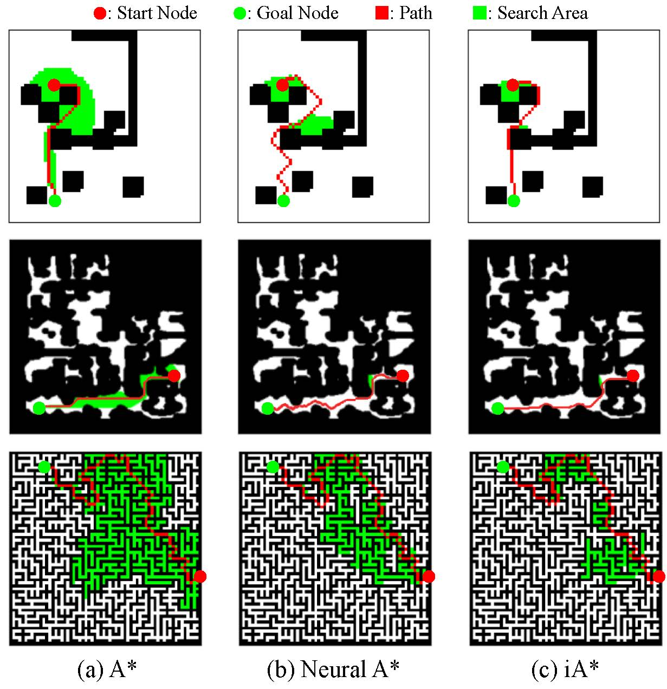
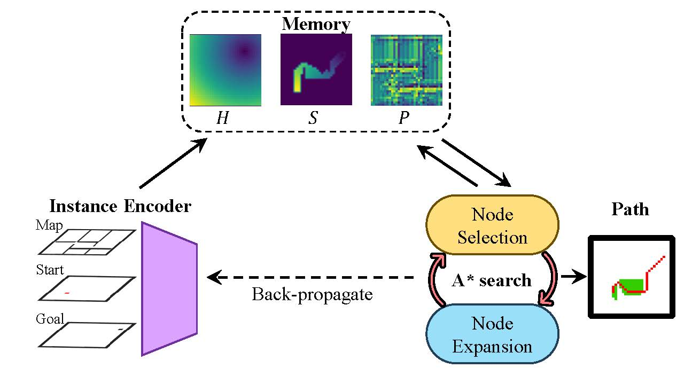
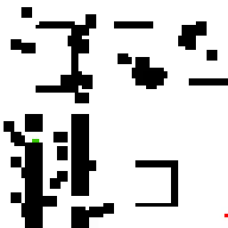
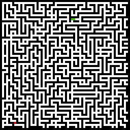
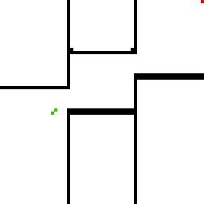
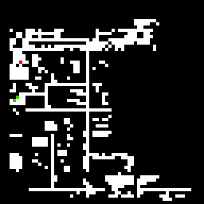

<h1 align="center">iA*: Imperative Learning-based A* Search for Path Planning</h1>

<strong>
    <a href = "https://xyc0212.github.io/">Xiangyu Chen</a>1,
    <a href = "https://github.com/MichaelFYang/">Fan Yang</a>2,
    <a href = "https://sairlab.org/team/chenw/">Chen Wang</a>1,
</strong>

<strong>
    <a href = "https://sairlab.org/">1:  Spatial AI & Robotics (SAIR) Lab, Computer Science and Engineering, University at Buffalo</a> 
    <a href = "https://rsl.ethz.ch/the-lab.html">2: Robotic Systems Lab, ETH Zurich, 8092 Z ̈urich, Switzerland</a> 
</strong>

<strong> 
    <a href = "https://arxiv.org/abs/2403.15870">&#128196; [PDF]</a> | 

</strong>

  

**Abstract:**     Path planning, which aims to find a collision-free path between two locations, is critical for numerous applications ranging from mobile robots to self-driving vehicles.
    Traditional search-based methods like A$^*$ search guarantee path optimality but are often computationally expensive when handling large-scale maps.
    While learning-based methods alleviate this issue by incorporating learned constraints into their search procedures, they often face challenges like overfitting and reliance on extensive labeled datasets. 
    To address these limitations, we propose Imperative A$^*$ (iA$^*$), a novel self-supervised path planning framework leveraging bilevel optimization (BLO) and imperative learning (IL). The iA$^*$ framework integrates a neural network that predicts node costs with a differentiable A$^*$ search mechanism, enabling efficient self-supervised training via bilevel optimization. 
    This integration significantly enhances the balance between search efficiency and path optimality while improving generalization to previously unseen maps. 
    Extensive experiments demonstrate that iA$^*$ outperforms both classical and supervised learning-based methods, achieving an average reduction of 9.6\% in search area and 15.2\% in runtime, underscoring its effectiveness in robot path planning tasks.

  

## Installation
### Dependencies
* CUDA
* python
* OpenCV
* PyPose
* Numpy

To run iA*, you need to install PyTorch. We recommend using Anaconda for installation. Check the official website for installation instructions for Anaconda and PyTorch accordingly.

### Step 1: Create a new conda environment
<pre> python conda create -n iastar python=3.10 </pre>

### Step 2: Activate the environment
<pre> conda activate iastar </pre>

### Step 3: Install dependencies from requirements.txt using pip
<pre> pip install -r requirements.txt </pre>
## Dataset
The dataset used in this paper can be found at [Google Drive](https://drive.google.com/drive/folders/12OTiSL7i-rWdLnkvGHwJZrZAjMdvrpDC?usp=sharing), as planning-dataset.zip.

After downloading, place the dataset into the folder and unzip it.
<pre>
unzip planning-dataset.zip
</pre>
The datatset contains 3 environments, MP Dataset, Maze Dataset, and Matterport Dataset.

The data structure is as follows:
<pre>
Planning-dataset
├── matterport
│   └── instances
│           └── 064
│                └── *.npz
├── maze
│   └── instances
│           └── 064
│                └── *.npz
├── mdp
│   └── instances
│           └── 064
└──              └── *.npz
</pre>
## Example
Examples of path planning tasks are provided in the *example* folder.
The well-trained models can be downloaded from [Google Drive](https://drive.google.com/file/d/1JQ44ZBfNv6Re8GlpCayzbTuamQSHb-Jm/view?usp=sharing).

After downloading, place the model file into the folder *model/iastar* for test.

  
  
  
  

## Training

We use the [wandb](https://wandb.ai/site) to record the training process. You need to create a wandb account and install it on your computer before running the code.

The training configuration file ''**config.yaml**'' is in the *config* folder.
<pre>
python train.py
</pre>

## Reference
If you utilize this codebase in your research, we kindly request you to reference our work. You can cite us as follows:
- iA*: Imperative Learning-based A* Search for Pathfinding.
Xiangyu Chen, Fan Yang, Chen Wang.
arXiv preprint arXiv:2403.15870, 2025.

The BiBTeX entry for LaTeX users is:
<pre>
@article{chen2025iastar,
  title = {{iA*}: Imperative Learning-based A* Search for Pathfinding},
  author = {Chen, Xiangyu and Yang, Fan and Wang, Chen},
  journal = {arXiv preprint arXiv:2403.15870},
  year = {2025},
  url = {https://arxiv.org/abs/2403.15870},
  code = {https://github.com/sair-lab/iAstar},
  website = {https://sairlab.org/iastar/},
  addendum = {SAIR Lab Selected}
}
</pre>

## Author
This codebase is maintained by [Xiangyu Chen](xiangyuc@sairlab.org). If you have any questions, please feel free to contact him at [xiangyuc@sairlab.org](xiangyuc@sairlab.org).
<!-- ##  TODO List

- [x] Initial release. :rocket: -->