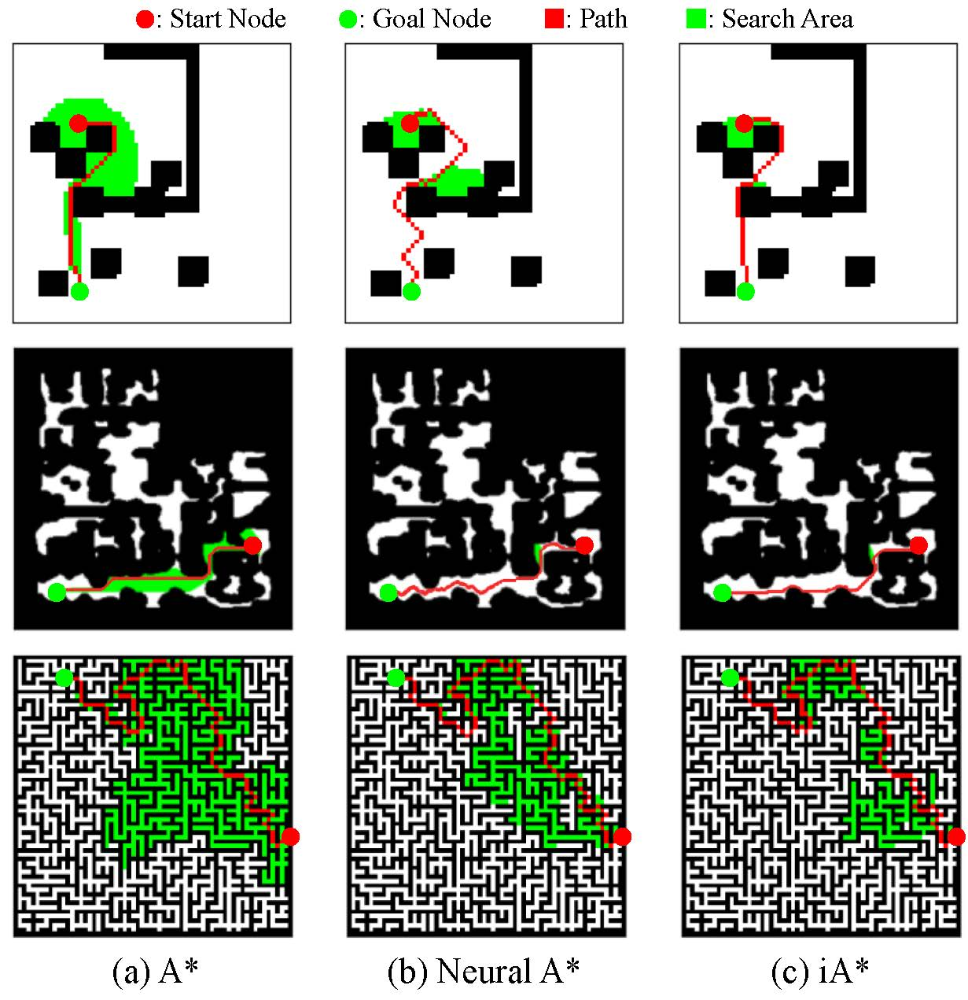
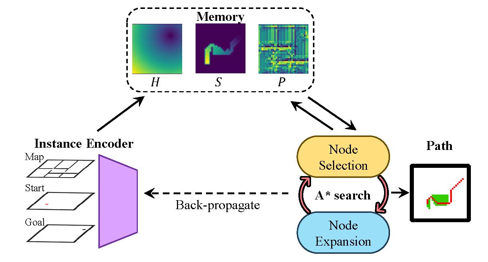
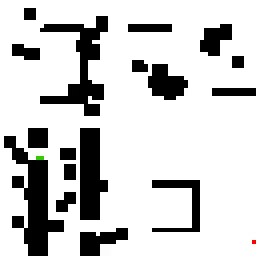
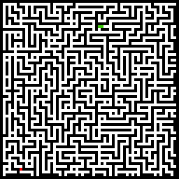
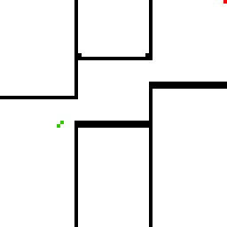
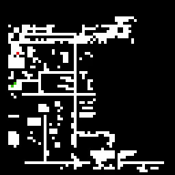

<h1 align="center">iA*: Imperative Learning-based A* Search for Path Planning</h1>

<p align="center"><strong>
    <a href = "https://xyc0212.github.io/">Xiangyu Chen</a><sup>1</sup>,
    <a href = "https://github.com/MichaelFYang/">Fan Yang</a><sup>2</sup>,
    <a href = "https://sairlab.org/team/chenw/">Chen Wang</a><sup>1</sup>,
</strong></p>

<p align="center"><strong>
    <a href = "https://sairlab.org/">1:  Spatial AI & Robotics (SAIR) Lab, Computer Science and Engineering, University at Buffalo</a><br>
    <a href = "https://rsl.ethz.ch/the-lab.html">2: Robotic Systems Lab, ETH Zurich, 8092 Zürich, Switzerland</a><br>
</strong></p>

<p align="center"><strong>
    <a href = "https://arxiv.org/abs/2403.15870">&#128196; [PDF]</a> |
    <a href = "https://sairlab.org/iastar/">&#127760; [Website]</a>
</strong></p>

<p align="middle">
  
</p>

**Abstract:** Path planning, which aims to find a collision-free path between two locations, is critical for numerous applications ranging from mobile robots to self-driving vehicles.
Traditional search-based methods like A\* search guarantee path optimality but are often computationally expensive when handling large-scale maps.
While learning-based methods alleviate this issue by incorporating learned constraints into their search procedures, they often face challenges like overfitting and reliance on extensive labeled datasets.
To address these limitations, we propose Imperative A\* (iA\*), a novel self-supervised path planning framework leveraging bilevel optimization (BLO) and imperative learning (IL). The iA\* framework integrates a neural network that predicts node costs with a differentiable A\* search mechanism, enabling efficient self-supervised training via bilevel optimization.
This integration significantly enhances the balance between search efficiency and path optimality while improving generalization to previously unseen maps.
Extensive experiments demonstrate that iA\* outperforms both classical and supervised learning-based methods, achieving an average reduction of 9.6% in search area and 15.2% in runtime, underscoring its effectiveness in robot path planning tasks.

<p align="middle">
  
</p>

The self-supervised imperative loss pulls the differentiable **search history** toward the planner's **own found path** — no ground-truth optimal paths are needed:

```text
loss = L1( search_history , found_path.detach() )
```

## Installation

```bash
conda create -n iastar python=3.10 -y
conda activate iastar

# 1) PyTorch — pick the CUDA index matching your GPU.
#    (Blackwell GPUs such as the RTX 5090 / sm_120 require the cu128 wheels:)
pip install torch torchvision --index-url https://download.pytorch.org/whl/cu128

# 2) Core + evaluation dependencies (numpy pinned < 2 for compatibility).
pip install "numpy==1.26.4" pyyaml opencv-python wandb \
            pandas matplotlib pytorch-lightning einops scikit-image scipy

# 3) Neural A* baseline — install with --no-deps so it cannot downgrade torch,
#    then add its two extra runtime deps.
pip install --no-deps "git+https://github.com/omron-sinicx/neural-astar.git"
pip install pqdict segmentation-models-pytorch
```

Exact pinned versions used for the reference results are in [`requirements.txt`](requirements.txt).
Sanity check the GPU build:

```bash
python -c "import torch; print(torch.__version__, torch.cuda.is_available(), torch.cuda.get_device_name(0))"
```

## Dataset

The 32×32 MP training data **ships with this repo**
(`planning-datasets/mpd/instances/032/mazes_032_moore_c8.npz`), so training works out of the box.

The full multi-size benchmark data (MP, Maze, and Matterport at 64/128/256) can be downloaded from
[Google Drive](https://drive.google.com/file/d/10LG7wf6UrG-8_fzAipzbBeSxg5W766uF/view?usp=sharing)
as `planning-datasets.zip`. Place it in the repo root and unzip:

```bash
unzip planning-datasets.zip
```

The data structure is as follows (npz format of the
[Neural A\* planning datasets](https://github.com/omron-sinicx/planning-datasets)):

```text
planning-datasets
├── mpd/instances/{064,128,256}/*.npz          # MP: mazes, forest, gaps, bugtraps, ...
├── maze/instances/{064,128,256}/*.npz         # large mazes
└── matterport/instances/{064,128,256}/*.npz   # TSDF maps from real Matterport3D scans
```

## Usage

### Train iA\*

```bash
mkdir -p logs model
python train.py --useIL          # self-supervised imperative loss (recommended)
python train.py                  # supervised variant: L1(history, optimal path)
```

Useful flags (defaults come from `config/config.yaml`): `--epochs`, `--map-num` (batch size),
`--encoder-arch` (`CNN`, `UNet`, `UNetAtt`, `FCN`), `--lr`, `--w` (heuristic weight, default 2.0),
`--gpu-id`. Checkpoints are written to `model/<timestamp>/<epoch>/iaster1UNet.pkl`.
Training logs to [wandb](https://wandb.ai/site); run offline with `WANDB_MODE=disabled`.

Pre-trained models are available on
[Google Drive](https://drive.google.com/file/d/1JQ44ZBfNv6Re8GlpCayzbTuamQSHb-Jm/view?usp=sharing)
(place under `model/iastar/`).

### Train the Neural A\* baseline

A Neural A\* baseline (supervised, UNet encoder) can be trained on the
**same data and budget** as iA\*:

```bash
python train_nastar.py           # -> model/nastar/nastar_unet_mazes032.pth
```

### Evaluate

```bash
python evaluate.py               # newest iA* checkpoint vs vanilla A*, test split
python evaluate.py --model model/<...>/iaster1UNet.pkl --w 2.0
```

### Benchmark (multi-size, multi-family)

Sweeps every dataset under `planning-datasets/{mpd,maze,matterport}/instances/<size>/` and reports
absolute nodes expanded, path length, and success rate for vanilla A\*, Neural A\*, and iA\*:

```bash
python benchmark.py              # sizes 064 128 256
python benchmark.py --sizes 064  # single size
python benchmark.py --skip-na    # without the Neural A* baseline
```

### Example

[`example/example.ipynb`](example/example.ipynb) renders side-by-side visualizations of the
explored area and found path for vanilla A\*, Neural A\*, and iA\*:

<div style="display: flex; justify-content: center; gap: 10px;">
  
  
  
  
</div>

## How it works

- **Encoder** ([`encoder.py`](encoder.py)) maps `(obstacle map, start, goal)` to a per-cell cost map.
- **Differentiable A\*** ([`dastar.py`](dastar.py)) runs A\* with a straight-through softmax over the
  open list, so the **search history is differentiable** w.r.t. the cost map. (The backtraced path
  is discrete — training signals go through the history.)
- **iA\* wrapper** ([`iastar.py`](iastar.py)) ties the encoder and the differentiable A\* together.
- **Loss** ([`train.py`](train.py), `CostofTraj`): self-supervised `L1(history, found_path.detach())` —
  the lower-level A\* solves the planning problem, and the upper level shrinks the search toward
  the path that solution induces (bilevel optimization / imperative learning).

## Repository layout

| path | description |
| --- | --- |
| `iastar.py` | iA\* model: cost-map encoder + differentiable A\* |
| `dastar.py` | differentiable A\* search |
| `encoder.py`, `layers.py` | cost-map encoder architectures (CNN / UNet / UNetAtt / FCN) |
| `train.py` | iA\* training (`--useIL` = self-supervised imperative loss) |
| `train_nastar.py` | Neural A\* baseline training (matched protocol) |
| `evaluate.py` | iA\* vs vanilla A\* evaluation |
| `benchmark.py` | multi-size, multi-family benchmark |
| `data_loader.py` | dataset loaders for the `.npz` shortest-path format |
| `config/config.yaml` | training / model / data configuration |
| `example/` | comparison notebook + rendered figures |
| `jps/` | Jumping Point Search reference implementation |
| `transpath/` | vendored TransPath modules (extended benchmarks) |
| `planning-datasets*/` | dataset generation scripts and source data |

## Reference

If you utilize this codebase in your research, we kindly request you to reference our work.
You can cite us as follows:

- iA\*: Imperative Learning-based A\* Search for Pathfinding.
  Xiangyu Chen, Fan Yang, Chen Wang.
  IEEE Robotics and Automation Letters (RA-L), 2025.

```bibtex
@article{chen2025iastar,
  title = {{iA*}: Imperative Learning-based A* Search for Path Planning},
  author = {Chen, Xiangyu and Yang, Fan and Wang, Chen},
  journal = {IEEE Robotics and Automation Letters (RA-L)},
  year = {2025},
  url = {https://arxiv.org/abs/2403.15870},
  code = {https://github.com/sair-lab/iAstar},
  website = {https://sairlab.org/iastar/},
}
```

## Author

This codebase is maintained by [Xiangyu Chen](https://xyc0212.github.io/). If you have any
questions, please feel free to contact him at [xiangyuc@sairlab.org](mailto:xiangyuc@sairlab.org).

## Acknowledgments

Builds on ideas and tooling from
[Neural A\*](https://github.com/omron-sinicx/neural-astar) and
[TransPath](https://github.com/AIRI-Institute/TransPath). Licensed under the [MIT License](LICENSE).
